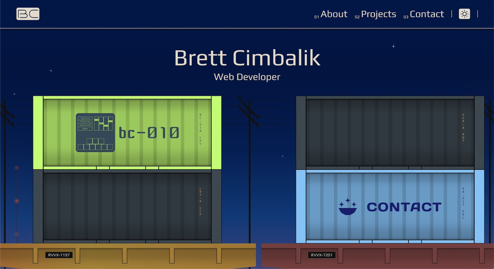
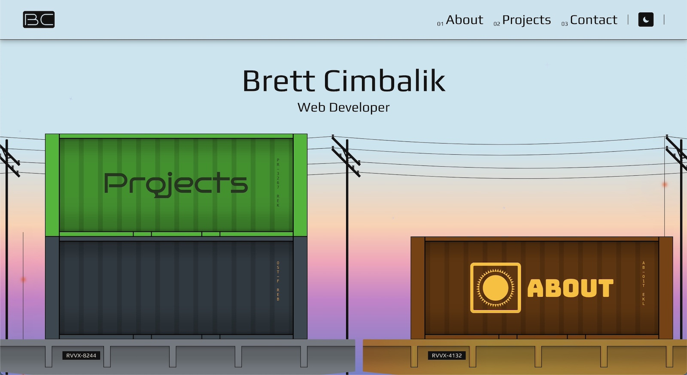

  <h1>My Portfolio 🗃️</h1>

---

## ⚡ Live Link ⚡

[Live Deploy](https://my-site-2-six.vercel.app/)

Night Theme:

Morning Theme:

## 🏗️ Built with 🏗️

- Next.js
- Typescript
- Styled Components
- Svgr

## 🚦 Getting Started 🚦

1. Clone the repo.
2. Copy the `.env.example` and create an `.env.local` at the root.
3. Run a `yarn install`.
4. Run a `yarn dev`.
5. View the site in your browser at `http://localhost:3000/`.

## 📚 Documentation📚

For more detailed docs -> [Start here](docs).
